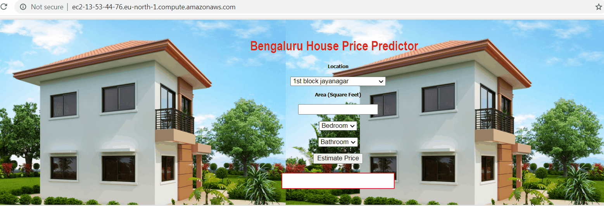

Project on building home price prediction website. Model is built using sklearn and linear regression using  bengaluru home prices dataset from kaggle.com.
Model is deployed to procution on AWS EC2 instance. Application and flask server is deployed on ubuntu server. Nginx web sever will serve http requests.
